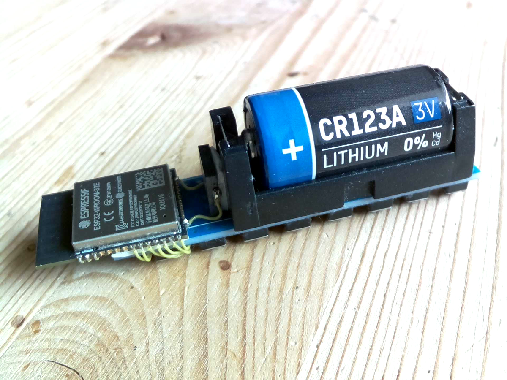
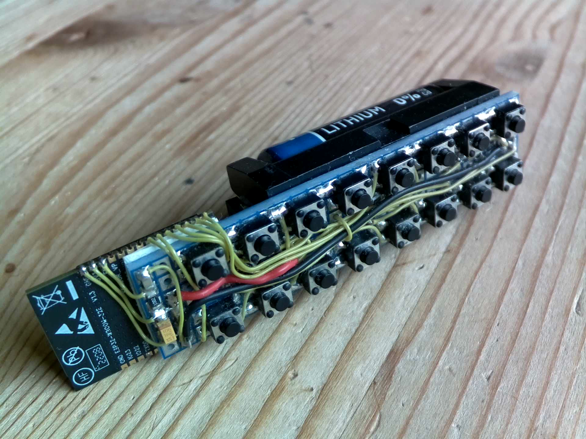

ultra-remote (ESP-IDF variant)
==============================

work in progress... stay tuned

preferring arduino-esp32? have a look at this: [fast ESP32 WiFi remote control (arduino-esp32 variant)](https://github.com/sp4rkie/ultra-remote-ino)

what is it
----------

- a fast ESP32 WiFi remote control with buttons
- various sizes are supported (currently 1 - 16 buttons)
- the [profile picture](https://avatars.githubusercontent.com/u/3232165?v=4) shows an engineering sample of the device (documentation will follow on [Hackaday.io](https://hackaday.io/))

project main objective
----------------------

- implement the fastest way possible to remote control a linux machine (including smartphones with [Termux](https://termux.dev/en/) and [Tasker](https://tasker.joaoapps.com/)) with an [ESP32](https://en.wikipedia.org/wiki/ESP32) device over WiFi 

project status as of current git (see protocol output)
------------------------------------------------------

- *220ms* average time span between keypress (wakeup) to status (received from remote machine)
- any pull requests to improve the current results are very welcome

basic functionality
-------------------

- wake up after key press
- connect to WiFi
- send an ascii command to a remote machine
- receive status from the remote machine
- go to deep sleep again

features
--------

- very fast (see project status)
- very small (see [profile picture](https://avatars.githubusercontent.com/u/3232165?v=4))
- low deep sleep current of about 5uA (measured 0.5V over 100k shunt)
- easy to build (documentation will follow)
- battery operated (CR123 A 3V)
- OTAable (press key before inserting the battery)

runtime environment
-------------------

- access point hardware in use: Raspberry Pi 4 Model B Rev 1.4
- access point software in use: debian version 11.6/ hostapd version 2:2.9.0-21
- remote target software to control: ucspi-tcp version 1:0.88-6

build environment
-----------------

- [ESP-IDF](https://docs.espressif.com/projects/esp-idf/en/latest/esp32/index.html#)

how to build
------------

- setup ESP-IDF as documented [here](https://docs.espressif.com/projects/esp-idf/en/latest/esp32/get-started/index.html#installation)
- then

        . ~/esp/esp-idf/export.sh
        git clone git@github.com:sp4rkie/ultra-remote-idf
        cd ultra-remote-idf
        idf.py -DCMAKE_C_FLAGS='-DESP32_2' flash monitor

debug protocol output as of current git
---------------------------------------

        rst:0x5 (DEEPSLEEP_RESET),boot:0x13 (SPI_FAST_FLASH_BOOT)
        configsip: 0, SPIWP:0xee
        clk_drv:0x00,q_drv:0x00,d_drv:0x00,cs0_drv:0x00,hd_drv:0x00,wp_drv:0x00
        mode:DIO, clock div:1
        load:0x3fff0030,len:1416
        load:0x40078000,len:14756
        load:0x40080400,len:4
        0x40080400: _init at ??:?

        load:0x40080404,len:3348
        entry 0x40080598
        TP01: 41                                                                    # <-- first trace point after 41ms
        TP02: 101 WiFi issued                                       
        cmd: 101 @beep= f:1000 c:1 t:.05 p:.25 g:-20 ^roja ^ -> rpi-5.toh.cx@8889   # <-- CMD sent 101ms after key press
        TP03: 141 WiFi connected                                                    # <-- asynchronous callback from WiFi
        stat: 171 #[XX]#[0]#[0]#[xxx]#[0]#[0]                                       # <-- STATUS reveived after 171ms(!) since key press (aka wakeup)
        E (181) wifi:NAN WiFi stop
        ets Jun  8 2016 00:22:57

