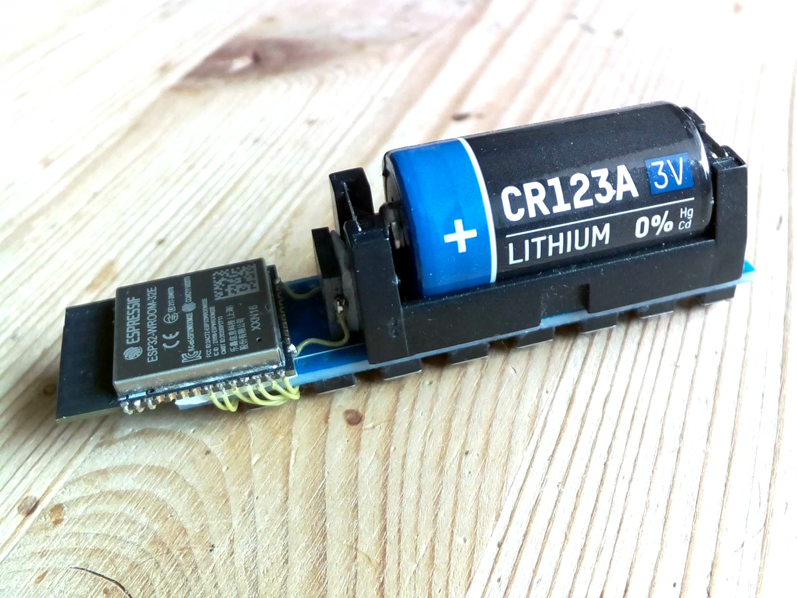
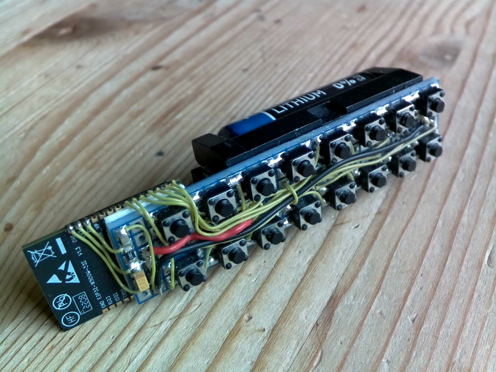
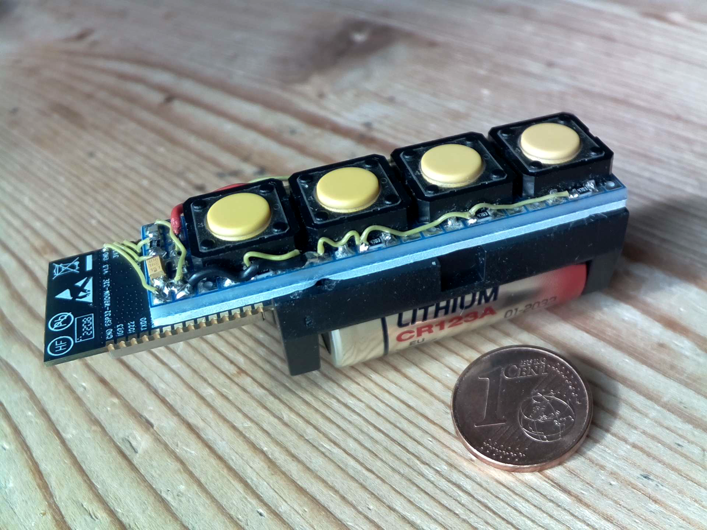
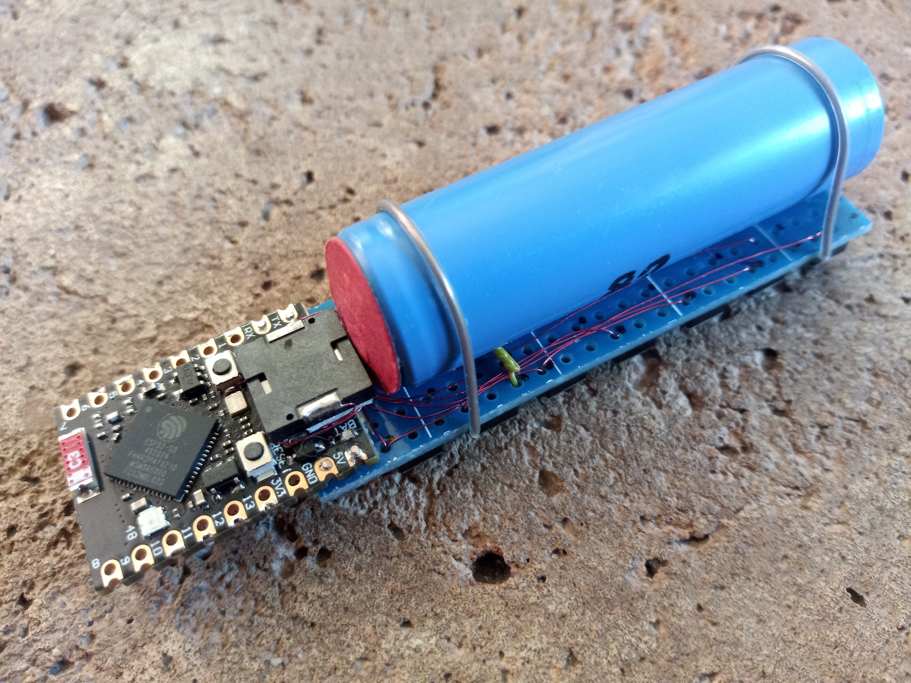
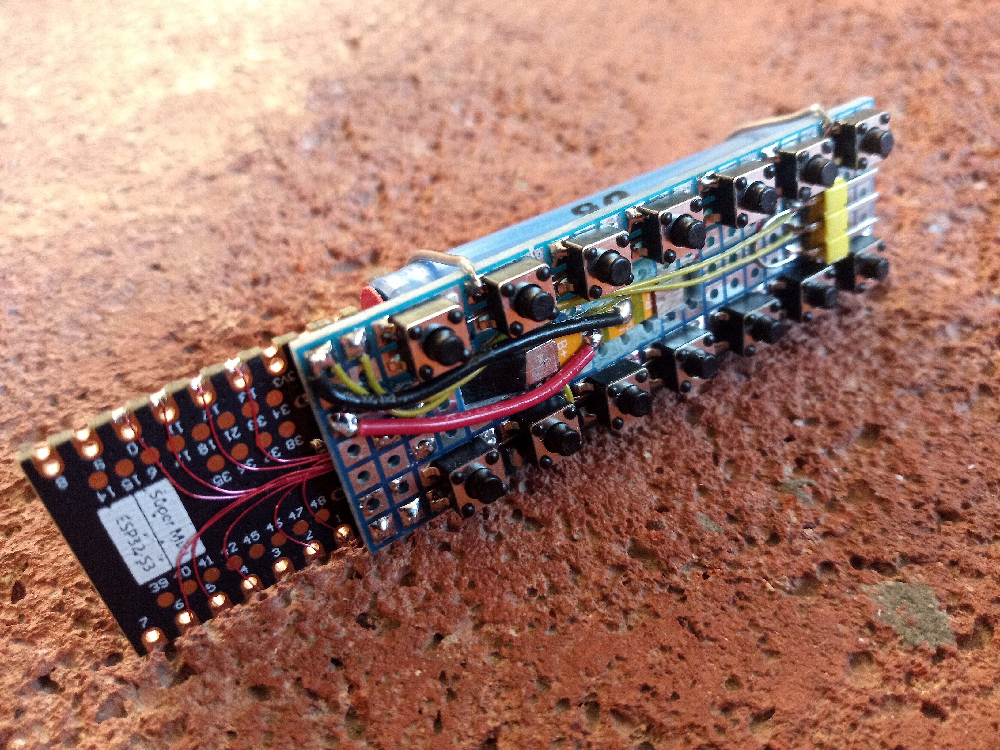

ultra-remote (ESP-IDF variant)
==============================

work in progress... stay tuned

preferring arduino-esp32? have a look at this: [fast ESP32 Wi-Fi remote control (arduino-esp32 variant)](https://github.com/sp4rkie/ultra-remote-ino)

what is it
----------

- a fast and small [ESP32](https://en.wikipedia.org/wiki/ESP32) Wi-Fi remote control with buttons for a PC or smartphone
- the [profile picture](https://avatars.githubusercontent.com/u/3232165?v=4) shows an engineering sample of the device (documentation will follow on [Hackaday.io](https://hackaday.io/))

project main objective
----------------------

- implement the fastest Wi-Fi remote control around for your PC or smartphone

project status as of current git (see protocol output)
------------------------------------------------------

- *180ms* average time span between keypress (wakeup) to status (received from remote machine)
- any pull requests to improve the current results are very welcome

basic functionality
-------------------

- wake up after key press
- connect to Wi-Fi
- send an ascii command to one or multiple remote machines
- receive status for one or multiple commands
- go to deep sleep again
- wake up to deep sleep typically passes in less than 200ms

features
--------

- ultra fast (see project status)
- ultra small (see [profile picture](https://avatars.githubusercontent.com/u/3232165?v=4))
- various key pad sizes are supported (currently 1 - 16 buttons)
- low deep sleep current of about 5uA (measured 0.5V over 100k shunt)
- only a few and cheap hardware parts are required 
- easy to build. some experience with SMD is beneficial though (documentation will follow)
- battery operated (CR123 A 3V)
- keymap/ profile switching per multi button press
- commands distributed across multiple wireless access points are supported
- acoustic feedback via buzzer for success/ failure activity provided on supported models
- OTAable per HTTP (press key before inserting the battery)

runtime environment for a PC
----------------------------

- access point hardware in use: Raspberry Pi 4 Model B Rev 1.4
- access point software in use: debian version 11.6/ hostapd version 2:2.9.0-21
- remote target software to control: ucspi-tcp version 1:0.88-6

runtime environment for a smartphone
------------------------------------

- smartphone is configured to provide an Wi-Fi hotspot
- [Termux](https://termux.dev/en/) and [Tasker](https://tasker.joaoapps.com/) apps are setup and running
- remote target software to control: netcat-openbsd 1.219-1-0

build environment
-----------------

- [ESP-IDF](https://docs.espressif.com/projects/esp-idf/en/latest/esp32/index.html#)

how to build
------------

- setup ESP-IDF as documented [here](https://docs.espressif.com/projects/esp-idf/en/latest/esp32/get-started/index.html#installation)
- then

        . ~/esp/esp-idf/export.sh
        git clone git@github.com:sp4rkie/ultra-remote-idf
        cd ultra-remote-idf

- the firmware is built for one device at a time. `main/build_id.h` says which, and the
  `#if ESP32_(n)` blocks in `main/ultra_remote.c` hold each device's keys and settings - pick the
  block that matches your board, or add one. for device 2, the tester:

        // main/build_id.h
        #pragma once
        #define PROJECT "ultra-remote-idf"
        #define ENTITY  2
        #define SERNO   "0001"
        #define MYDATE  "26-10-01"

- then build and flash with that file forced into every compile:

        OPTS_="-include $PWD/main/build_id.h" idf.py flash monitor

- `OPTS_` is read when cmake first configures the build: after changing it, remove `build/`
- `SERNO` is the firmware version the OTA update check compares (hex), `MYDATE` a free label
- fill in your own access points and target hosts in `main/mcfg.h`: the values shipped there are
  placeholders, not working credentials

debug protocol output as of current git
---------------------------------------

        rst:0x5 (DEEPSLEEP_RESET),boot:0x13 (SPI_FAST_FLASH_BOOT)
        configsip: 0, SPIWP:0xee
        clk_drv:0x00,q_drv:0x00,d_drv:0x00,cs0_drv:0x00,hd_drv:0x00,wp_drv:0x00
        mode:DIO, clock div:1
        load:0x3fff0030,len:1416
        load:0x40078000,len:14800
        load:0x40080400,len:4
        0x40080400: _init at ??:?

        ho 8 tail 4 room 4
        load:0x40080404,len:3348
        entry 0x40080598
        TP01: 43
                    # <-- first trace point after 43ms
        VBat: 1520mV
        TP02: 87 WiFi issued
        cmd: 87 @beep= f:1000 c:1 t:.05 p:.25 g:-20 ^host2 ^ -> host1.example.com@8889
                    # <-- CMD sent 87ms after key press
        TP03: 123 WiFi connected
                    # <-- asynchronous callback from Wi-Fi after 123ms
        RSSI: -73 DE 0x14 0x00
        stat: 151 #[XX]#[0]#[0]#[xxx]#[0]#[0]
                    # <-- STATUS reveived after 151ms(!) since key press (aka wakeup)
        E (155) wifi:NAN WiFi stop

